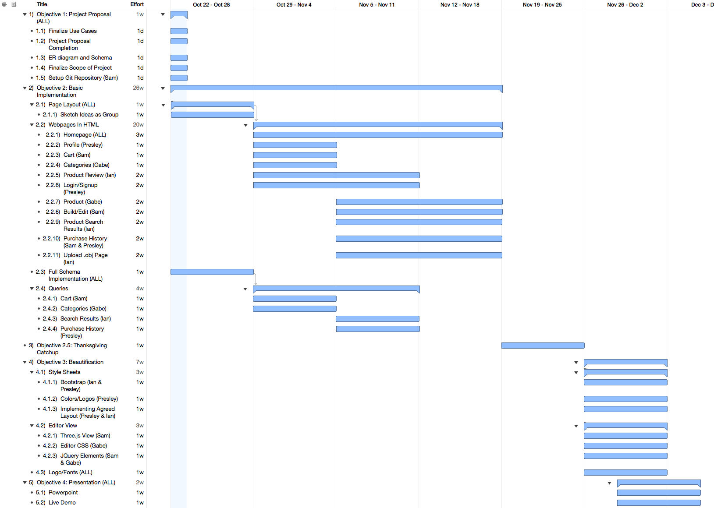

# modular
## Contributors
- Gabriel Pinkard
- Ian White
- Presley Reed III
- Sam Burdick

### About Modular
Modular is an application that allows users to order 3D printed models on demand as well as create/upload and share their own models. Users will be able to log into individual accounts with their own profile information and list of 3D models they have created and/or purchased. Users will also be able to browse the site for models that other users have created/uploaded. Along with the ability to upload models from third parties, users will be able to, in browser, create their own models that are saved and viewable by other users. Likewise users will be able to edit other people’s models and save the new modified models to their profile. Our database will be used not only to store basic user information such as name, userid, age, bio, purchasing history, created models, hashed password, and contact info/social media profiles. The database will also hold all of the model data including price, material, number of purchases, dimensions, category, and creator/editors. 

### Gantt Chart

